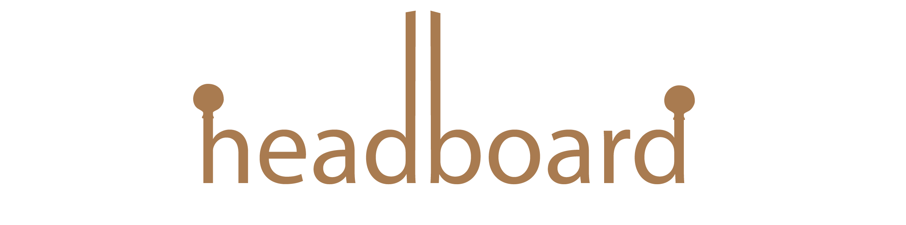

#### A customizable new tab or home page.
Features:
- Auto changing background pulled from Google's Arts and Culture


# Customizing
## Base Config

| Key           | Default   | Description               |
|---------------|-----------|---------------------------|
| title         | headboard | title of the page         |
| default_theme | dark      | valid values: light, dark |
| cards         | []        | list of cards you want to display |

## Cards Config

### Generic Card Config
These config values can be applied to any card
| Key        | Default | Description              |
|------------|---------|--------------------------|
| id         | error   | type of card see [Types](#types)    |
| text_color | auto    | text color of card       |
| bg_color   | auto    | background color of card |
| rowSpan    | 1       | how may rows card spans  |
| colSpan    | 1       | how many cols card spans |

## Types
### List
A card that contains a list of text or links. To configure the links in this card create a key called elements and add a list of objects with text, link, or both. For example

```
  - id: list
    elements:
      - link: www.google.com
        text: google
      - text: just text
      - link: justlink.com
```

### Spacer
A card that displays nothing but takes up the space of a normal card. Used for properly structuring your grid.


